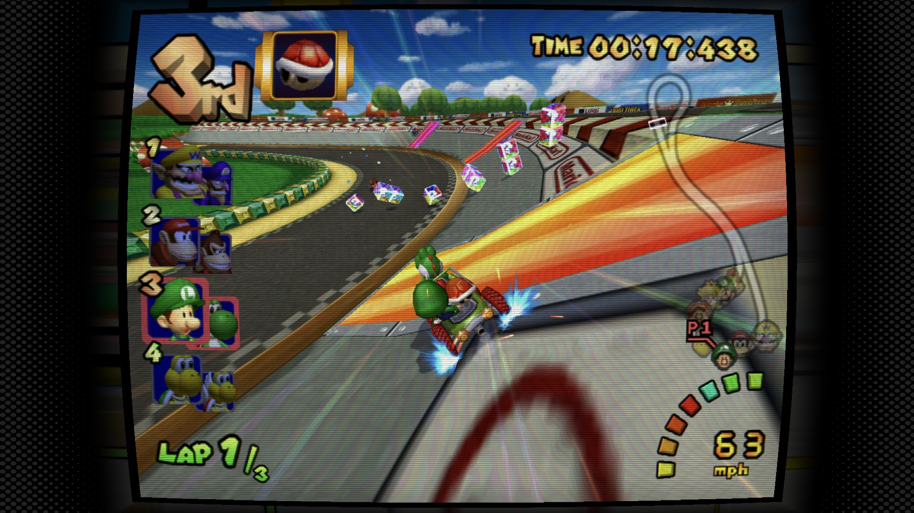
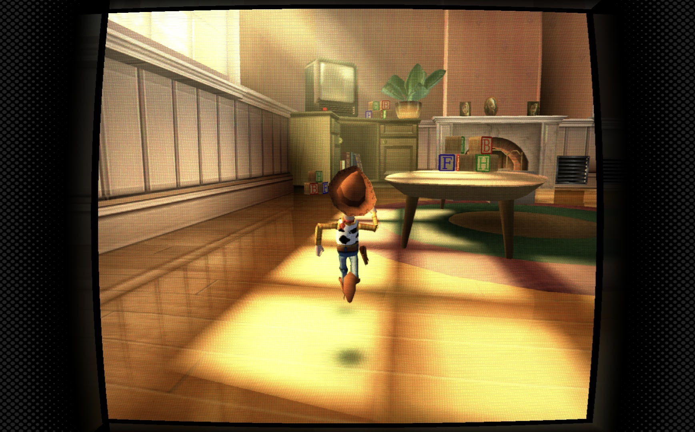

# LinkinCRT-NSO

A fork of [Linkinworm/dolphin-post-process-s](https://github.com/Linkinworm/dolphin-post-process-s) (LinkinCRT) that adds a **Nintendo Switch Online-style background** to the side bars, keeping the CRT curvature and all the post-processing from the original shader.

Available in **GLSL (Vulkan)** and **Slang**.

> Mario Kart: Double dash!! running on Dolphin.

> Toy Story 3 running on ARMSX2.

## What's different

- Side bars use a dark grey background with a dotted mesh, inspired by the NSO classic game display
- Slang conversion of the shader, in addition to the original GLSL version

Everything else (CRT curvature, scanlines, masks, bloom, and the rest of the options) comes from LinkinCRT and works the same way.

## Files

- `LinkinCRT_NSO_Vulkan.glsl`: GLSL version for Dolphin (Vulkan)
- `LinkinCRT_NSO.slang`: Slang version for emulators that support slang shaders

## How install on dolphin

1. Copy the `.glsl` file into the `Shaders` folder inside your Dolphin user directory.
2. In Dolphin, go to **Graphics → Enhancements → Post-Processing Effect** and select the shader.
3. Use the **Vulkan** backend.

4. Set Dolphin's aspect ratio to **Force 16:9**.

## Credits

- Original shader: [Linkinworm](https://github.com/Linkinworm/dolphin-post-process-s). All the CRT work is theirs.
- NSO-style background, Slang conversion and tweaks: [me](https://github.com/kauaconceicao)

The original repository does not include a license. This fork is shared as a derivative of that work, and I'm happy to follow the author's wishes.
